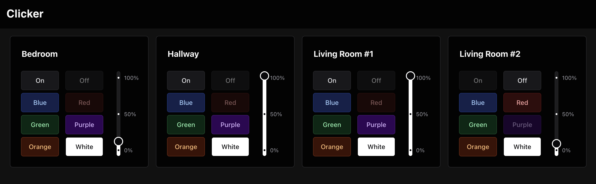

# Clicker

UI and API for Tapo lights using `python-kasa`.



I run this as part of [my website](https://github.com/Xtrendence/xtrendence.com) so it will link to assets not contained within this repo.

You will need to create a `keys.txt` and `lights.txt` file in `./api/` with the following content:

`keys.txt` (replace with randomly generated strings):

```
[
    "token-1",
    "token-2",
    "token-3"
]
```

`lights.txt`:

```
[
    {
        "id": 1,
        "mac": "00:00:00:00:00",
        "ip": "192.168.1.2",
        "name": "Light Bulb 1"
    },
    {
        "id": 2,
        "mac": "00:00:00:00:00:00",
        "ip": "192.168.1.3",
        "name": "Light Bulb 2"
    }
]
```